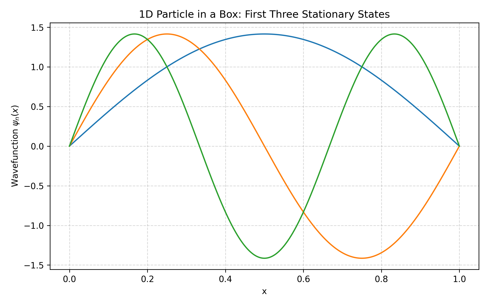

# Quantum Wave Packets in 1D and 2D

## Overview
This project simulates **1D and 2D quantum wave packets** for a particle in a box using Python. It covers:

- Calculation of stationary wavefunctions for the first few quantum states
- Probability density plots for 1D and 2D wavefunctions
- Time-dependent wave packet simulations using superposition of states
- 1D and 2D animations of wave packet evolution
- Visualization of probability densities and wave packet dynamics

The project is implemented in both a Python script and Jupyter notebooks  located in the `simulations/` folder for interactive exploration.

---

## Project Structure
```
Quantum_Wave_Packets_1D_2D/
│
├── animations/
├── plots/
├── simulations/
│   ├── Quantum_Wave_Packets_1D_2D.ipynb
│   └── Quantum_Wave_Packets_1D_2D.py
├── requirements.txt
├── .gitignore
└── README.md
```

---

## Installation Instructions

1. **Clone the repository**
```bash
git clone https://github.com/mzohaibh17-pixel/Quantum_Wave_Packets_1D_2D.git
cd Quantum_Wave_Packets_1D_2D
```

2. **Create a virtual environment and activate it**
```bash
python -m venv venv
venv\Scripts\activate        # Windows
# source venv/bin/activate   # Linux / Mac
```
3. **Install dependencies**
```bash
pip install -r requirements.txt
```

---

## Features

- Computes stationary wavefunctions and probability densities in 1D and 2D
- Calculates energy eigenvalues for different quantum states
- Simulates time-dependent wave packets using superposition of quantum states
- Generates plots:
  - 1D stationary wavefunctions
  - Ground state probability density
  - 1D wave packet probability density at t=0
  - 2D probability density plots
  - 2D wave packet probability density at t=0
- Creates animations:
  - 1D wave packet evolution
  - 2D wave packet evolution
- Fully self-contained Jupyter notebook and Python script for easy execution 

---

## Usage
1. **Run the Jupyter notebook** (recommended):
```bash
jupyter notebook simulations/Quantum_Wave_Packets_1D_2D.ipynb
```

2. **Or run the Python script**:
```bash
python simulations/Quantum_Wave_Packets_1D_2D.py
```

---

## Outputs

The project generates the following visualizations and animations:

- **1D Wavefunctions:**
  - First three stationary states
  - Ground state probability density
  - Time-dependent 1D wave packet evolution

- **2D Wavefunctions:**
  - Probability density plots for specific quantum states
  - Time-dependent 2D wave packet evolution

- **Animations:**
  - `1D_wave_packet.gif` showing evolution of the 1D wave packet
  - `2D_wave_packet.gif` showing evolution of the 2D wave packet

All generated plots and animations are automatically saved in their respective folders: `plots/` and `animations/`.

---

## Dependencies

- Python 3.x
- numpy
- matplotlib
- pillow

> All dependencies are included in `requirements.txt`, so you can install everything at once using `pip install -r requirements.txt`.   

---

## References

- Griffiths, *Introduction to Quantum Mechanics*, 2nd Edition – for theory of quantum wavefunctions and particle in a box  
- Sakurai, *Modern Quantum Mechanics*, Revised Edition – for advanced quantum concepts  
- NumPy Documentation: [https://numpy.org/doc/](https://numpy.org/doc/) – for array computations and numerical operations in Python  
- Matplotlib Documentation: [https://matplotlib.org/stable/contents.html](https://matplotlib.org/stable/contents.html) – for plotting and creating animations in Python

---

## Author / Credits

**Muhammad Zohaib Hassan**  
Bachelor’s in Physics, University of Sargodha  
GitHub: [mzohaibh17-pixel](https://github.com/mzohaibh17-pixel)  
Email: mzohaibh17@gmail.com  

This project is for educational and research purposes in computational physics.  
It is licensed under the **MIT License**, which requires including the copyright notice in any copies or substantial portions of the software.  
If you use, adapt, or fork this project, please give proper credit to the author.

---

## Visualizations

The following plots provide a visual summary of the Quantum Wave Packets project:

### 1D Stationary States


### Ground State Probability Density


### 1D Wave Packet at t=0


### 2D Probability Density


### 2D Wave Packet at t=0


### 1D Wave Packet Animation


### 2D Wave Packet Animation


